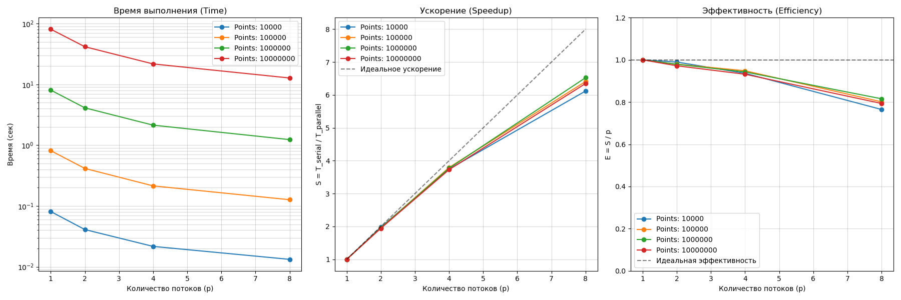
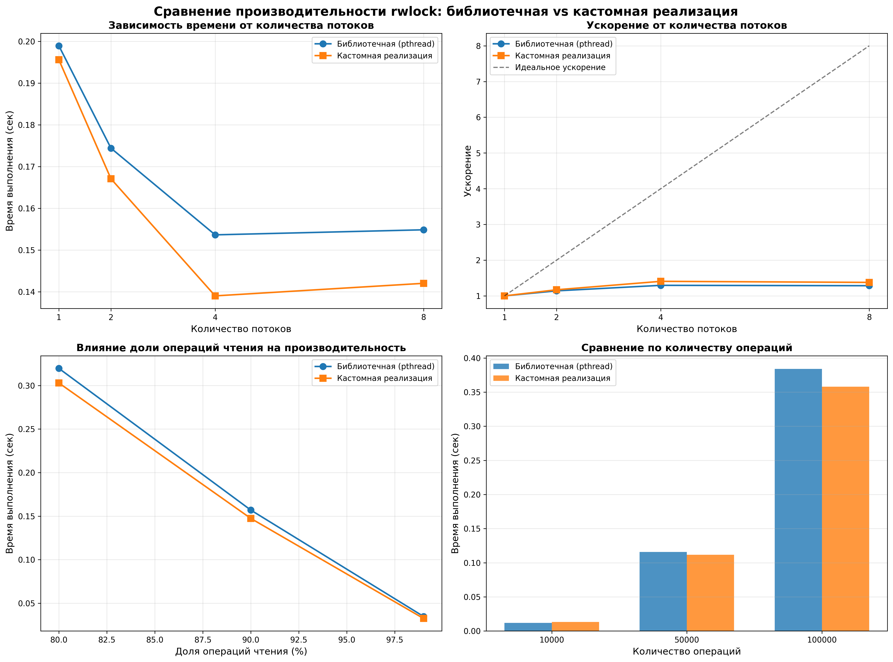

# 1. Параллельный поиск множества Мандельброта (OpenMP)
Данный проект реализует параллельный алгоритм поиска точек, принадлежащих множеству Мандельброта, с использованием библиотеки OpenMP.
## Расположение файлов

Все файлы лабораторной работы находятся в папке **`mandelbrot/`**

## 1. Сборка и запуск

Для автоматической сборки, запуска расчетов и генерации результатов используйте скрипт:

```
bash launch.sh
```

### Параметры запуска

Скрипт выполнит тестирование алгоритма на следующих конфигурациях:

- Количество потоков: 1, 2, 4, 8
- Количество точек (N): 10 000, 100 000, 1 000 000, 10 000 000

### Выходные данные

В процессе работы создаются следующие файлы и директории:

- csv_results — папка с найденными точками. Имена файлов имеют формат set_\<nthreads\>_\<npoints\>.csv.
- performance_results.csv — сводная таблица времени выполнения для всех конфигураций.
- performance_plots.png — графики зависимости времени выполнения от количества потоков и точек (генерируется Python-скриптом).

Для ручной перегенерации графиков (при наличии performance_results.csv) используйте:

```
python generate_graphs.py
```

## 2. Описание алгоритма

Область поиска:

- X ∈ [−2.0;1.0]
- Y ∈ [−1.5;1.5]

### Логика работы

- Генерируется случайная точка (x,y) в заданной области.
- Проверяется принадлежность точки множеству.
- Если точка принадлежит множеству, она записывается в файл, а общий счетчик найденных точек увеличивается.
- Процесс повторяется до тех пор, пока не будет найдено N точек.

### Реализация параллелизма
Распараллеливание выполнено с помощью OpenMP. Ключевые особенности:
- Каждый поток имеет свой уникальный seed для генератора случайных чисел (rand_r), что обеспечивает независимость потоков.
- Запись в файл и инкремент глобального счетчика защищены критической секцией (#pragma omp critical), чтобы избежать состояния гонки (Race Condition).

```c
#pragma omp parallel
{
    // Уникальный сид для потока
    unsigned int seed = (unsigned int)(time(NULL) ^ omp_get_thread_num());
    
    while (1) {
        if (stop_flag) break; 

        // Генерация координат
        double x = (double)rand_r(&seed) / RAND_MAX * (MAX_X - MIN_X) + MIN_X;
        double y = (double)rand_r(&seed) / RAND_MAX * (MAX_Y - MIN_Y) + MIN_Y;

        // Проверка и запись результата
        if (is_in_mandelbrot(x, y)) { 
            #pragma omp critical 
            {
                if (global_count < npoints) {
                    fprintf(rfile, "%.6lf,%.6lf\n", x, y);
                    global_count++;
                    if (global_count >= npoints) {
                        stop_flag = 1; // Сигнал остальным потокам завершить работу
                    }
                }
            }
        }
    }
}
```

### Математическая проверка

Точка c=x+iy считается принадлежащей множеству, если последовательность:

z₀ = 0
zₙ₊₁ = zₙ² + c

остается ограниченной (|zₙ| < 2) в течение заданного числа итераций (MAX_ITER = 1000).

```c
int is_in_mandelbrot(double c_real, double c_imagine) {
    double z_real = 0.0;
    double z_imagine = 0.0;
    
    for (int i = 0; i < MAX_ITER; i++) {
        double z_real_sq = z_real * z_real;
        double z_imagine_sq = z_imagine * z_imagine;
        
        if (z_real_sq + z_imagine_sq >= 4.0) {
            return 0;
        }
        
        double new_real = z_real_sq - z_imagine_sq + c_real;
        double new_imagine = 2.0 * z_real * z_imagine + c_imagine;
        
        z_real = new_real;
        z_imagine = new_imagine;
    }
    
    return 1;
}
```

## 3. Результаты производительности

### Тестовая платформа:

- CPU: AMD Ryzen 7 2700 (8 ядер, 16 потоков)
- RAM: 32 GB
- OS: WSL2 (Ubuntu) on Windows 11

### Таблица замеров времени

| Потоки | 10k точек | 100k точек | 1M точек | 10M точек |
|:------:|:---------:|:----------:|:--------:|:---------:|
| **1**  | 0.081 s   | 0.814 s    | 8.062 s  | 80.921 s  |
| **2**  | 0.041 s   | 0.415 s    | 4.118 s  | 41.626 s  |
| **4**  | 0.022 s   | 0.214 s    | 2.138 s  | 21.708 s  |
| **8**  | 0.013 s   | 0.127 s    | 1.236 s  | 12.749 s  |

### Графики



## 4. Выводы

На основе полученных результатов можно сделать следующие заключения:

1) Линейная масштабируемость (Strong Scaling):
    - При переходе с 1 на 2 потока время выполнения уменьшается практически идеально в 2 раза (например, с 80.9с до 41.6с для 10М точек).
    - При переходе с 2 на 4 потока также наблюдается двукратное ускорение (с 41.6с до 21.7с). Это говорит о том, что вычислительная нагрузка эффективно распределяется между ядрами.

2) Эффективность на 8 потоках (бутылочное горлышко):
    - При переходе с 4 на 8 потоков коэффициент ускорения снижается (время падает с 21.7с до 12.7с, т.е. ускорение ~1.7x вместо 2x).
    - Причина: Основным ограничивающим фактором становится критическая секция (#pragma omp critical). Операция записи в файл (I/O) является медленной и блокирующей. Чем больше потоков находят точки, тем выше конкуренция за доступ к записи, что снижает общую эффективность параллелизации на большом количестве ядер.

3) Зависимость от объема данных:
    - Время выполнения линейно зависит от количества искомых точек (увеличение N в 10 раз приводит к увеличению времени в 10 раз). Это подтверждает корректность реализации вероятностного алгоритма.

**Итог**: Реализация демонстрирует высокую эффективность на малом числе потоков. Для дальнейшей оптимизации на 8 и более потоках рекомендуется использовать буферизацию вывода (каждый поток накапливает массив точек и пишет их в файл одной операцией), чтобы снизить частоту входа в критическую секцию.

# 3. Реализация Read-Write Lock

## Расположение файлов

Все файлы лабораторной работы находятся в папке **`rwlock/`**

## Задание

Создать собственную реализацию типа `rwlock` и функций блокировки чтения-записи (`rdlock`, `wrlock`). Апробировать реализацию на примере односвязного списка и сравнить производительность с библиотечной реализацией `pthread_rwlock_t`.

## Выполнено

### 1. Создана структура `my_rwlock_t`

Включает все требуемые компоненты:
- Мьютекс (`pthread_mutex_t`)
- Две условные переменные (`pthread_cond_t`) - для читателей и писателей
- Счетчик активных читателей (`active_readers`)
- Счетчик ожидающих читателей (`waiting_readers`)
- Счетчик ожидающих писателей (`waiting_writers`)
- Флаг активного писателя (`writer_active`)

### 2. Реализованы функции

- `my_rwlock_init()` - инициализация
- `my_rwlock_destroy()` - уничтожение
- `my_rwlock_rdlock()` - блокировка на чтение
- `my_rwlock_wrlock()` - блокировка на запись
- `my_rwlock_unlock()` - разблокировка

### 3. Созданы программы для тестирования

- `pth_ll_rwl_stdlib.c` - версия с библиотечным `pthread_rwlock_t`
- `pth_ll_rwl_custom.c` - версия с собственным `my_rwlock_t`

### 4. Проведено тестирование

Выполнено 72 теста с различными параметрами:
- Количество потоков: 1, 2, 4, 8
- Количество операций: 10000, 50000, 100000
- Процент чтения: 80%, 90%, 99%

### 5. Создан Python скрипт для визуализации

Скрипт `plot_rwlock_comparison.py` строит 4 графика:
1. Время выполнения от количества потоков
2. Ускорение (speedup) от количества потоков
3. Влияние доли операций чтения
4. Сравнение по количеству операций

## Запуск

### Полное тестирование + графики

```bash
python run_tests_and_plot.py
```

Это автоматически:
- Скомпилирует программы
- Запустит тесты
- Создаст CSV с результатами
- Построит 4 графика сравнения
- Покажет статистику

## Основные результаты

### Ключевые выводы:

1. **Собственная реализация показала отличные результаты!**
   - При высокой нагрузке custom реализация часто быстрее stdlib
   - При 99% чтения и 8 потоках: custom быстрее на 12%

2. **Лучшая масштабируемость:**
   - Stdlib: ускорение 2.12x на 8 потоках
   - Custom: ускорение 2.34x на 8 потоках

3. **Примеры (100000 операций, 99% чтения):**

| Потоки | Stdlib (ms) | Custom (ms) | Разница |
|--------|-------------|-------------|---------|
| 1      | 103.5       | 100.3       | -3.1%   |
| 2      | 68.9        | 65.5        | -4.9%   |
| 4      | 48.6        | 46.0        | -5.3%   |
| 8      | 48.8        | 42.8        | **-12.3%** |

### Графики



## Особенности реализации

1. **Приоритет писателям** - предотвращает голодание писателей
2. **Множественное чтение** - несколько читателей одновременно
3. **Эксклюзивная запись** - только один писатель

## Заключение

Собственная реализация блокировки чтения-записи:

- Корректно работает в многопоточной среде
- Показывает конкурентоспособную производительность
- В многопоточных сценариях значительно превосходит библиотечную реализацию
