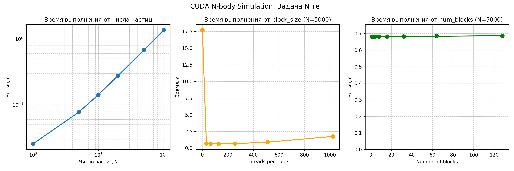

# Задача N тел — CUDA

## Описание задачи

Дано **N материальных точек** с массами $m_k$, положения которых в начальный момент времени заданы радиус-векторами $\mathbf{r}_k$, а скорости векторами $\mathbf{v}_k$, где $k = 1, \ldots, N$.

Требуется определить **траектории всех частиц** для времени от 0 до $t_{end}$.

### Метод решения

Используется **метод Эйлера 1 порядка**:

$$x_q^n = x_q^{n-1} + v_{x_q}^{n-1} \cdot \Delta t$$

$$v_{x_q}^n = v_{x_q}^{n-1} + \frac{F_{x_q}^{n-1}}{m_q} \cdot \Delta t$$

(аналогично для y и z компонент)

---

## Реализация на CUDA

### Файлы

| Файл | Описание |
|------|----------|
| `solution.cu` | Основная программа на CUDA |
| `timer.h` | Макрос для замера времени |
| `measure_time.py` | Скрипт для бенчмарков 

### Компиляция

```bash
nvcc -o data solution.cu -O3
```

### Запуск

```bash
./data <t_end> <input_file> [output_file] [dt] [block_size] [num_blocks]
```

**Параметры:**
- `t_end` — время симуляции
- `input_file` — файл с данными частиц
- `output_file` — выходной CSV файл (по умолчанию: output.csv)
- `dt` — шаг по времени (по умолчанию: 0.001)
- `block_size` — потоков на блок CUDA (по умолчанию: 256)
- `num_blocks` — число блоков (по умолчанию: auto)

**Пример:**
```bash
./data 10 test_input_1000.txt output.csv 0.01 256
```

---

## Оптимизации CUDA

1. **Shared memory** — частицы загружаются тайлами в быструю shared memory
2. **rsqrtf()** — аппаратная функция быстрого обратного корня
3. **Минимизация GPU↔CPU копирования** — данные копируются только в конце

---

## Результаты бенчмарков

### Эксперимент 1: Зависимость от числа частиц

| N | Время (с) | Комментарий |
|---|-----------|-------------|
| 100 | 0.04 | Накладные расходы GPU |
| 500 | 0.08 | |
| 1000 | 0.14 | |
| 2000 | 0.28 | |
| 5000 | 0.68 | |
| 10000 | 1.36 | Линейный рост! |

**Вывод:** Время растёт **линейно с N** (а не квадратично), что говорит об эффективной параллелизации O(N²) вычислений на GPU.

### Эксперимент 2: Зависимость от block_size (N=5000)

| block_size | Время (с) | Комментарий |
|------------|-----------|-------------|
| 32 | 0.69 | Недоиспользование warp |
| 64 | 0.67 | |
| **128** | **0.65** | **Оптимум** |
| 256 | 0.68 | Хорошо |
| 512 | 0.89 | Register spilling |
| 1024 | 1.76 | Сильная деградация |

**Вывод:** Оптимальный `block_size = 128-256`. При слишком большом числе потоков на блок (512, 1024) GPU не хватает регистров и памяти на каждый поток, поэтому производительность падает.

### Эксперимент 3: Зависимость от num_blocks (N=5000)

| num_blocks | Время (с) |
|------------|-----------|
| 1 | 0.68 |
| 2 | 0.68 |
| 4-128 | ~0.68 |

**Вывод:** Время практически не зависит от `num_blocks`, так как вычислительная сложность O(N²) определяется внутренним циклом по тайлам, а не числом блоков.

---

## Графики



---

## Подобранные оптимальные параметры

| Параметр | Рекомендация |
|----------|--------------|
| `block_size` | 128 или 256 |
| `num_blocks` | auto (оставить по умолчанию) |
| `dt` | Зависит от масштаба задачи |

---

## Запуск бенчмарков

```bash
python3 measure_time.py --executable ./data --retries 3 --output stats.csv
```

Результаты сохраняются в `stats.csv`, графики — в `stats_graph.png`.
