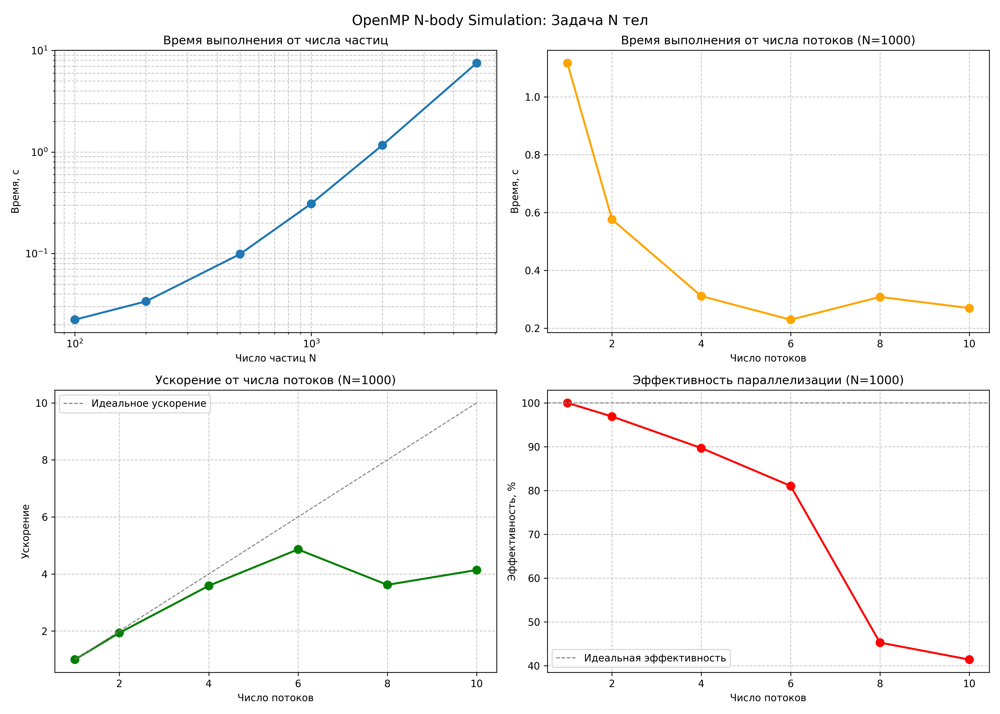

# Задача N тел — OpenMP

## Описание задачи

Моделирование гравитационного взаимодействия N тел (частиц) в трёхмерном пространстве. Каждая частица имеет массу, координаты и скорость. На каждом шаге симуляции вычисляются гравитационные силы между всеми парами частиц, после чего обновляются скорости и координаты. 

В данном случае я проводил замеры с использованием третьего закона Ньютона и без него: получилось, что без его использования ускорение получается лучше, проблема — гонка данных при параллелизации. Когда поток обрабатывает пару (i, j), он пишет и в Fx[i], и в Fx[j]. Другой поток может одновременно писать в Fx[j] при обработке пары (k, j).

## Сборка и запуск

### Сборка (macOS)

```bash
clang -o nbody solution.c -O3 -Xpreprocessor -fopenmp \
    -I$(brew --prefix libomp)/include \
    -L$(brew --prefix libomp)/lib -lomp -lm
```

### Запуск

```bash
./nbody <t_end> <input_file> <output_file> <dt> <num_threads>
```

Пример:
```bash
./nbody 10 test_input_1000.txt output.csv 0.01 4
```

## Используемые функции OpenMP

**1. Вычисление сил (`compute_forces`):**

```c
#pragma omp parallel for schedule(static)
for (int i = 0; i < n; i++) {
    double fx = 0, fy = 0, fz = 0;
    
    for (int j = 0; j < n; j++) {
        // Суммируем силы от всех частиц
    }
    
    Fx[i] = fx;  // Каждый поток пишет в свою ячейку — нет конфликтов
}
```

**2. Интегрирование (`integrate_euler`):**

```c
#pragma omp parallel for schedule(static)
for (int i = 0; i < n; i++) {
    // Обновляем скорости и координаты частицы i
}
```

- **Нет гонок данных** — каждый поток работает со своим набором частиц и пишет в свои ячейки массивов `Fx[i]`, `Fy[i]`, `Fz[i]`
- **Нет синхронизации** — не используются `#pragma omp atomic`, `#pragma omp critical` или барьеры, которые замедляют выполнение
- **Равномерная нагрузка** — каждая частица требует O(N) операций, поэтому `schedule(static)` распределяет работу равномерно

## Результаты экспериментов



### Время выполнения

Лучшее время выполнения получается при числе потоков == 6. Дальше время выполнения уже увеличивается, связано с эффективностью, см. дальше.

### Зависимость ускорения и эффективности от числа потоков (N=1000)

| Потоки | Ускорение | Эффективность |
|--------|-----------|---------------|
| 1      | 1.0x      | 100%          |
| 2      | 1.9x      | 97%           |
| 4      | 3.6x      | 90%           |
| 6      | 4.9x      | 81%           |
| 8      | 3.6x      | 45%           |
| 10     | 4.1x      | 41%           |


**Линейное ускорение до 4-6 потоков** — эффективность составляет 81-97%, что является отличным результатом.

При большем числе потоков ускорение уже не увеличивается, а эффективность значительно падает. Возможно из-за того, что:
   - Накладные расходы на создание и управление потоками слишком большие
   - Конкуренция за память и кэш

## Замер времени

```bash
python3 measure_time.py --executable ./nbody --t_end 10 --retries 3
```

Параметры:
- `--executable` — путь к исполняемому файлу (по умолчанию `./nbody`)
- `--t_end` — время симуляции (по умолчанию 10)
- `--dt` — шаг по времени (по умолчанию 0.01)
- `--retries` — число повторов для усреднения (по умолчанию 3)
- `--output` — файл для сохранения результатов (по умолчанию `stats.csv`)
